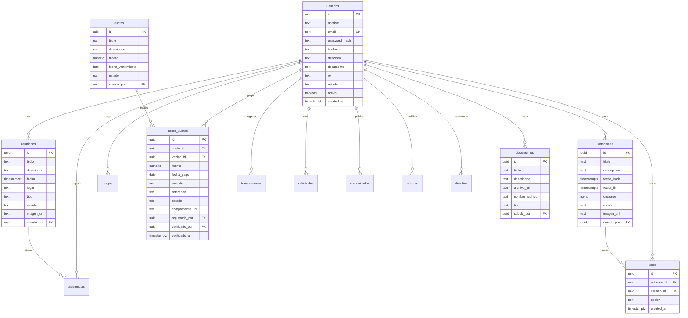

# Diagrama de Base de Datos - Neighbord

```mermaid
erDiagram
  usuarios ||--o{ reuniones : crea
  usuarios ||--o{ asistencias : registra
  usuarios ||--o{ votaciones : crea
  usuarios ||--o{ votos : emite
  usuarios ||--o{ pagos : paga
  usuarios ||--o{ pagos_cuotas : paga
  usuarios ||--o{ transacciones : registra
  usuarios ||--o{ solicitudes : crea
  usuarios ||--o{ comunicados : publica
  usuarios ||--o{ noticias : publica
  usuarios ||--o{ directiva : pertenece
  usuarios ||--o{ documentos : sube

  reuniones ||--o{ asistencias : tiene
  votaciones ||--o{ votos : recibe
  cuotas ||--o{ pagos_cuotas : recibe

  usuarios {
    uuid id PK
    text nombre
    text email UK
    text password_hash
    text telefono
    text direccion
    text documento
    text rol
    text estado
    boolean activo
    timestamptz created_at
  }

  reuniones {
    uuid id PK
    text titulo
    text descripcion
    timestamptz fecha
    text lugar
    text tipo
    text estado
    text imagen_url
    uuid creado_por FK
  }

  votaciones {
    uuid id PK
    text titulo
    text descripcion
    timestamptz fecha_inicio
    timestamptz fecha_fin
    jsonb opciones
    text estado
    text imagen_url
    uuid creado_por FK
  }

  votos {
    uuid id PK
    uuid votacion_id FK
    uuid usuario_id FK
    text opcion
    timestamptz created_at
  }

  cuotas {
    uuid id PK
    text titulo
    text descripcion
    numeric monto
    date fecha_vencimiento
    text estado
    uuid creado_por FK
  }

  pagos_cuotas {
    uuid id PK
    uuid cuota_id FK
    uuid vecino_id FK
    numeric monto
    date fecha_pago
    text metodo
    text referencia
    text estado
    text comprobante_url
    uuid registrado_por FK
    uuid verificado_por FK
    timestamptz verificado_at
  }

  documentos {
    uuid id PK
    text titulo
    text descripcion
    text archivo_url
    text nombre_archivo
    text tipo
    uuid subido_por FK
  }
```
